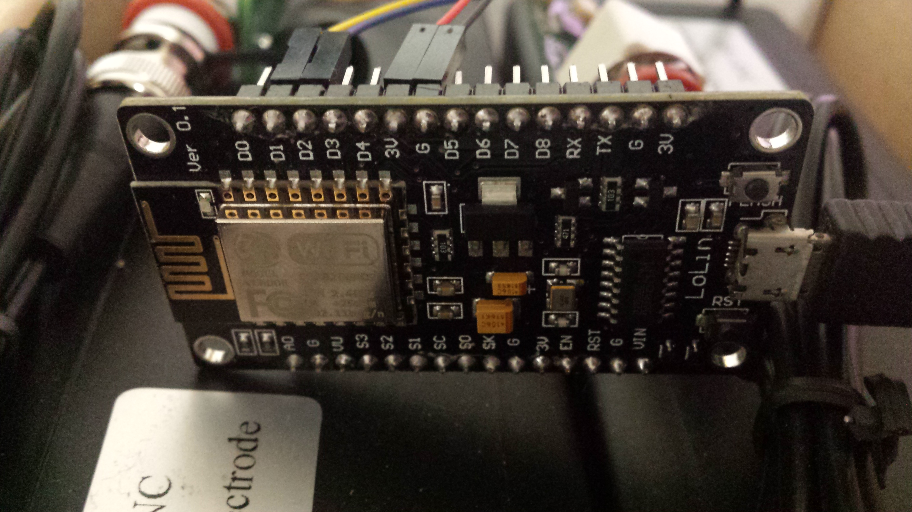
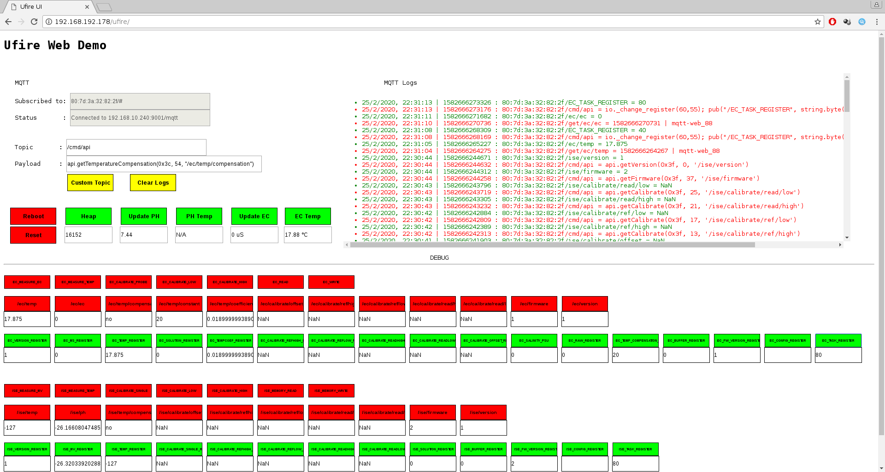

NodeMCU Lua port of the [μFire](https://ufire.co) library for Isolated ISE/EC sensors interfaces: https://ufire.co

# Lua module for μFire Isolated sensors interfaces
Extends support for μFire interfaces to NodeMCU firmware based devices.

Original library for [EC Probe Interface](https://github.com/u-fire/Isolated_EC) (Arduino, Rust and Python) <br/>
Original library for [ISE PH/ORP Interface](https://github.com/u-fire/Isolated_ISE) (Arduino, Rust and Python) <br/>
<br/>

## Preamble
These scripts are written in [Lua](www.lua.org) for NodeMCU firmware.<br/>
[NodeMCU](https://nodemcu.readthedocs.io/en/master/) is an open source Lua based firmware for the ESP8266 WiFi SOC from Espressif<br/>
Take a look at the following output, showing my setup, to check target sdk and modules to enable at build stage (*) <br/>
~~~
NodeMCU 3.0.0.0
        branch: master
        commit: 71a182caa7841cbb478ed90ede526dc881943c80
        release: 3.0-master_20190907 +1
        release DTS: 
        SSL: false
        build type: float
        LFS: 0x0
        modules: bit,file,i2c,mqtt,net,node,spi,struct,tmr,uart,wifi
 build 2020-01-25 00:55 powered by Lua 5.1.4 on SDK 3.0.1-dev(fce080e)
~~~
(*)
*Edit `nodemcu-firmware/app/include/user_modules.h` to enable/disable modules, rebuild with `make` and flash the ESP with `esptool`. Below the example commands to flash a device connected to port /dev/ttyUSB0:<br/>*
~~~
esptool.py --port /dev/ttyUSB0 erase_flash
esptool.py --port /dev/ttyUSB0 write_flash -fm qio 0x00000 bin/0x00000.bin 0x10000 bin/0x10000.bin
~~~
<br/>

## Warnings
This code represents a very first attempt to port the python original library for RaspberryPi.<br/>
Still missing many function calls, others need to be tested.<br/>
Also, the code is messy and prone to memory leaks.<br/>
Feel free to modify it, eventually sharing improvements, but use it at your own risk!<br/>
<br/>

## ESP-8266 Wiring
`sda` and `scl` pins are hardcoded in `i2c-setup.lua` script<br/>
```
local id, scl, sda = 0, 1, 2
-- scl: PIN 1 (I/O index) = GPIO5 (D1)
-- sda: PIN 2 (I/O index) = GPIO4 (D2)
```



See [ESP-8266 Pinout](https://nodemcu.readthedocs.io/en/master/modules/gpio/) for gpio reference<br/>

## Using it
Clone the repository
~~~
git clone https://github.com/mitmdev/Isolated_ISE_EC.git --depth=1
~~~
Upload all the .lua files in the lua/ folder to your ESP, leaving `init.lua` for last one.<br/>

The default minimal configuration simply loads the ufire library and is intended mainly for api testing via ESPlorer or similar serial ttys.<br/>
Furthermore, to access the api, two other alternative configurations are proposed.<br/><br/>

The "full-featured" setup, requires the following external components:<br>
- HTTP server (apache, Nginx...) hosting the demo page
- MQTT broker (mosquitto with websockets support)
normally hosted on a rpi.<br/>
The MQTT protocol is used to accomplish communication with the module.<br/><br/>

The "standalone" configuration, instead, doesn't require any external component, but is limitated by the memory available on the board (and/or my poor programming skills), therefore it's not recommended in production environment.<br/><br/>


Switching:
~~~
local minimal = true
~~~
to
~~~
local minimal = "mqtt"
~~~
in `init.lua`, enables wifi and mqtt support.<br/>
You will need to customize wifi connection parameters in `init-wifi.lua` and mqtt broker configuration in `mqtt-client.lua`, modifying the following variables accordingly to your setup.
<br/>
`init-wifi.lua`:
~~~
local SSID = "SSID"
local KEY  = "PASSWORD"
~~~
`mqtt-client.lua`:
~~~
local user = "BROKER_USER"
local pass = "BROKER_PASSWORD"
local host = "BROKER_IP"
local port = BROKER_PORT
~~~
Follows up an example configuration, valid for a wireless network with SSID *UFIRE* and key *PASSWORD*, broker located at address *192.168.10.240*, listening to default tcp port *1883* and requiring user (*ufire*) and password (*ufire*) authentication:
<br/>

<br/>

`init-wifi.lua`:
```
local SSID = "UFIRE"
local KEY  = "PASSWORD"
```
`mqtt-client.lua`:
```
local user = "ufire"
local pass = "ufire"
local host = "192.168.10.240"
local port = 1883
```

<br/>

## API Calls
For shared api calls, when needed, choose the target interface, setting boolean `ecprobe` to `true` for ec interface, `false` for ise one.<br/>
~~~
ecprobe = true  => ec  interface
ecprobe = false => ise interface
~~~
example:<br/>
~~~
 api.reset(0x3c, true,  topic) => reset ec registers
 api.reset(0x3f, false, topic) => reset ise registers
~~~
###### Shared API
~~~
 api.measure(0x3c, 55, 40, 5, 750, "/ec/temp")
 api.measure(0x3c, 55, 80, 1, 750, "/ec/ec")
 api.measure(0x3f, 39, 40, 5, 750, "/ise/temp")
 api.measure(0x3f, 39, 80, 1, 250, "/ise/ph")
 api.setTemp(0x3c, 5, tempC, "/ec/set/temp")
 api.setTemp(0x3f, 5, tempC, "/ise/set/temp")
 api.useTemperatureCompensation(0x3c, 1, 54, true|false)
 api.useTemperatureCompensation(0x3f, 1, 38, true|false)
 api.getTemperatureCompensation(0x3c, 54, "/ec/temp/compensation")
 api.getTemperatureCompensation(0x3f, 38, "/ise/temp/compensation")
 api.reset(0x3c, true, topic)
 api.reset(0x3f, false, topic)
 api.getCalibrate(0x3c, 33, "/ec/calibrate/offset")
 api.getCalibrate(0x3f, 9, "/ise/calibrate/offset")
 api.getCalibrate(0x3c, 17, "/ec/calibrate/ref/high")
 api.getCalibrate(0x3f, 13, "ise/calibrate/ref/high")
 api.getCalibrate(0x3c, 21, "/ec/calibrate/ref/low")
 api.getCalibrate(0x3f, 17, "/ise/calibrate/ref/low")
 api.getCalibrate(0x3c, 25, "/ec/calibrate/read/high")
 api.getCalibrate(0x3f, 21, "/ise/calibrate/read/high")
 api.getCalibrate(0x3c, 29, "/ec/calibrate/read/low")
 api.getCalibrate(0x3f, 25, "/ise/calibrate/read/low")
 api.calibrate(0x3c, 55, 20, 750, solution, true, "/ec/calibrate/single")
 api.calibrate(0x3f, 39, 20, 250, solution, false, "/ise/calibrate/single")
 api.calibrate(0x3c, 55, 10, 750, solution, true, "/ec/calibrate/low")
 api.calibrate(0x3f, 39, 10, 250, solution, false, "/ise/calibrate/low")
 api.calibrate(0x3c, 55, 8, 750, solution, true, "/ec/calibrate/high")
 api.calibrate(0x3f, 39, 8, 250, solution, false, "/ise/calibrate/high")
 api.setDualPointCalibration(refLow, refHigh, readLow, readHigh, ecprobe true|false)
 api.getFirmware(0x3c, 53, "/ec/firmware")
 api.getFirmware(0x3f, 37, "/ise/firmware")
 api.getVersion(0x3c, 0, "/ec/version")
 api.getVersion(0x3f, 0, "/ise/version")
~~~

###### EC interface API
~~~
 api.setTempConstant(tempC)
 api.getTempConstant()
 api.setTempCoefficient(temp_coef)
 api.getTempCoefficient()
 api.setCalibrateOffset(offset) [why ec only?]
~~~
<br/>

## MQTT Topics
Topics are hardcoded in `mqtt-client.lua` and follow the following syntax:
~~~
 wifi_mac_of_esp8266/get/[ise|ec]/[temp|ph|ec]  [Measurement api]
 wifi_mac_of_esp8266/node/[heap|restart]        [Node api]
 wifi_mac_of_esp8266/cmd/api                    [payload representing command to execute on esp]
~~~
###### Measurement
 ~~~
 Get ISE interface temperature:
 Command topic  : 00:11:22:33:44:55/get/ise/temp
 Response topic : 00:11:22:33:44:55/ise/temp

 Get EC  interface temperature:
 Command topic  : 00:11:22:33:44:55/get/ec/temp
 Response topic : 00:11:22:33:44:55/ec/temp

 Get ISE interface Ph:
 Command topic  : 00:11:22:33:44:55/get/ise/ph
 Response topic : 00:11:22:33:44:55/ise/ph

 Get EC  interface Ec:
 Command topic  : 00:11:22:33:44:55/get/ec/ec
 Response topic : 00:11:22:33:44:55/ec/ec
~~~
###### Calibration
 Please use the generic topic:
 ~~~
 wifi_mac_of_esp8266/cmd/api
~~~
 and payload consisting in the command to execute, e.g.:
~~~
 api.getCalibrate(0x3c, 33, "/ec/calibrate/offset")
~~~

 ###### Temperature
 ~~~
 api.setTemp(0x3c, 5, tempC, "/ec/set/temp")
 api.setTemp(0x3f, 5, tempC, "/ise/set/temp")
 api.useTemperatureCompensation(0x3c, 1, 54, true|false)
 api.useTemperatureCompensation(0x3f, 1, 38, true|false)
 api.getTemperatureCompensation(0x3c, 54, "/ec/temp/compensation")
 api.getTemperatureCompensation(0x3f, 38, "/ise/temp/compensation")
 ~~~

 ###### Read Calibration
 ~~~
 api.getCalibrate(0x3c, 33, "/ec/calibrate/offset")
 api.getCalibrate(0x3f, 9, "/ise/calibrate/offset")
 api.getCalibrate(0x3c, 17, "/ec/calibrate/ref/high")
 api.getCalibrate(0x3f, 13, "ise/calibrate/ref/high")
 api.getCalibrate(0x3c, 21, "/ec/calibrate/ref/low")
 api.getCalibrate(0x3f, 17, "/ise/calibrate/ref/low")
 api.getCalibrate(0x3c, 25, "/ec/calibrate/read/high")
 api.getCalibrate(0x3f, 21, "/ise/calibrate/read/high")
 api.getCalibrate(0x3c, 29, "/ec/calibrate/read/low")
 api.getCalibrate(0x3f, 25, "/ise/calibrate/read/low")
 ~~~

 ###### Calibrate
 ~~~
 api.calibrate(0x3c, 55, 20, 750, solution, true, "/ec/calibrate/single")
 api.calibrate(0x3f, 39, 20, 250, solution, false, "/ise/calibrate/single")
 api.calibrate(0x3c, 55, 10, 750, solution, true, "/ec/calibrate/low")
 api.calibrate(0x3f, 39, 10, 250, solution, false, "/ise/calibrate/low")
 api.calibrate(0x3c, 55, 8, 750, solution, true, "/ec/calibrate/high")
 api.calibrate(0x3f, 39, 8, 250, solution, false, "/ise/calibrate/high")
 api.setDualPointCalibration(refLow, refHigh, readLow, readHigh, ecprobe true|false)
 ~~~

 ###### EC only
 ~~~
 api.setTempConstant(tempC)
 api.getTempConstant()
 api.setTempCoefficient(temp_coef)
 api.getTempCoefficient()
 api.setCalibrateOffset(offset) [why ec only?]
 ~~~

 ###### Reset Calibration
 ~~~
 api.reset(0x3c, true, topic)
 api.reset(0x3f, false, topic)
 ~~~

###### Node
~~~
 Show Node Heap:
 Command topic  : 00:11:22:33:44:55/node/heap
 Response topic : 00:11:22:33:44:55/heap
 
 Reboot board:
 Command topic  : 00:11:22:33:44:55/node/restart
 Response topic : 00:11:22:33:44:55/restart
~~~
<br/>

###### Websockets Demo
Html page illustrating a simple interaction with sensors through the mosquitto MQTT broker.<br/>
A running http server is required - pages are not hosted on the esp8266 itself.<br/>
Also note that we are using websockets here, so mosquitto needs to be compiled accordingly.<br/>

Please customize your broker setting in `config.js`.<br/>
Follows up a screenshot showing connection and message exchange:<br/>




## Embedded http server

Switching:
~~~
local minimal = true
~~~
to
~~~
local minimal = "http"
~~~
in `init.lua`, enables wifi and an integrated web server, reachable at your esp8266's IP address.<br/>
This is a "standalone" setup, no broker is needed. 
Wifi connection parameters are defined in `init-wifi.lua`.<br/>
 
Please note that only a small subset of functions is implemented, due to memory limits.<br/>
For shared keys, please use value `1` for ec interface, `0` for ise one, e.g.:

```
http://ip_address_of_esp8266/getCalibrateOffset=1	=> returns the ec  interface Calibrate Offset Register
http://ip_address_of_esp8266/getCalibrateOffset=0	=> returns the ise interface Calibrate Offset Register
```

###### WEB API
```
# node
/reboot=1
/heap=1

# ise
/ise_mv=1
/ise_temp=1

# ec
/ec_ec=1
/ec_temp=1

# shared keys
/getCalibrateOffset=1|0
/getCalibrateRefHigh=1|0
/getCalibrateRefLow=1|0
/getCalibrateReadHigh=1|0
/getCalibrateReadLow=1|0
/getTemperatureCompensation=1|0
/getTempConstant=1|0
/getTempCoefficient=1|0
/getFirmware=1|0
/getVersion=1|0

```


## Final thoughts
TODO

###### Memory limits
 Due to ESP8266 memory limitations, it was impossible to export the whole set of APIs to the MQTT interface.<br/>
 Therefore, only the main functions have been made directly available (for implemented MQTT topics, see Measurement api)<br/>
 The remaining api calls are available to MQTT through the generic topic:</br>
~~~
 wifi_mac_of_esp8266/cmd/api
~~~
 and payload consisting in the command to execute, e.g.:
~~~
 api.getCalibrate(0x3c, 33, "/ec/calibrate/offset")
~~~
 See `api-ref.lua` for a list of available commands.
 
###### Code optimization

